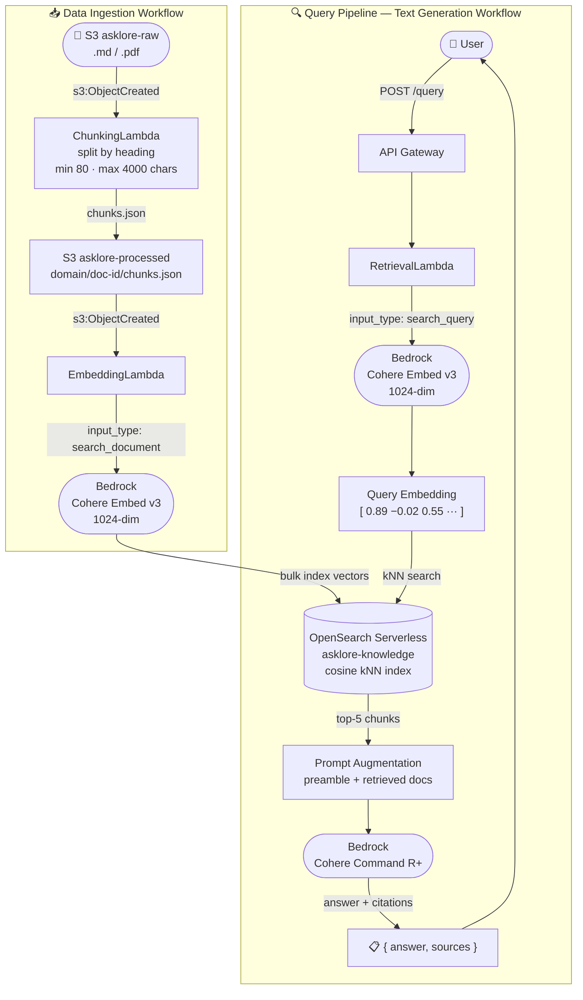

# AskLore

Internal tribal-knowledge RAG assistant built on AWS. Drop a markdown or PDF document into S3 and get grounded, cited answers back via a REST API — no hallucination, every answer traced to a source.

---

## Architecture



**Query flow:** `POST /query` → `RetrievalLambda` embeds the query (Cohere Embed v3, `search_query`), runs kNN search top-5 against OpenSearch, augments a preamble prompt with the retrieved chunks, calls Cohere Command R+, returns only the actually-cited sources from `citations[]`.

**Ingestion flow:** S3 upload → `ChunkingLambda` splits by heading (min 80 / max 4000 chars, writes `chunks.json`) → `EmbeddingLambda` embeds each chunk (Cohere Embed v3, `search_document`, 1024-dim) and bulk-indexes into OpenSearch Serverless.

---

## AWS Services

| Role | Service |
|---|---|
| Document storage + event trigger | S3 + S3 Event Notifications |
| Embeddings | Bedrock Cohere Embed English v3 (`cohere.embed-english-v3`, 1024-dim) |
| Generation | Bedrock Cohere Command R+ (`cohere.command-r-plus-v1:0`) |
| Vector search | OpenSearch Serverless — VECTORSEARCH collection `asklore` |
| Compute | Lambda (Python 3.12) |
| API | API Gateway REST — `POST /query` |
| IaC | CloudFormation (`template.yaml`) |

## Repository layout

```
template.yaml                   # CloudFormation — all Phase 1 resources
lambda/
  chunking/
    handler.py                  # S3 event → parse markdown/PDF → chunks.json
    requirements.txt
  embedding/
    handler.py                  # chunks.json → Cohere Embed v3 → OpenSearch bulk index
    requirements.txt
  retrieval/
    handler.py                  # query → kNN search → Command R+ → cited answer
    requirements.txt
scripts/
  build-and-deploy.sh           # build Lambda packages with uv, package, deploy
  index-all.py                  # one-shot local indexer (bypasses Lambda concurrency)
seed-data/
  infra-runbooks/               # 18 sample markdown runbooks (domain 1)
```

Lambda source dirs contain only `handler.py` + `requirements.txt`. Installed packages are generated into `build/` by `scripts/build-and-deploy.sh` and gitignored.

## Local setup

Requires [uv](https://github.com/astral-sh/uv) and AWS CLI v2.

```bash
# Create project venv (Python 3.12, matches Lambda runtime)
uv venv .venv --python 3.12
source .venv/bin/activate

# Install local tooling (boto3, opensearch-py for scripts/)
uv pip install boto3 opensearch-py requests-aws4auth requests
```

## Deploy

**Prerequisites:** Bedrock model access enabled for **Cohere Embed English v3** and **Cohere Command R+** (Bedrock console → Model access → Modify model access).

```bash
# One-time: create an S3 bucket for CloudFormation artifacts
aws s3 mb s3://asklore-cfn-artifacts-$(aws sts get-caller-identity --query Account --output text)

# Build Lambda packages, package template, and deploy (all in one)
bash scripts/build-and-deploy.sh

# View outputs (bucket names, AOSS endpoint, API URL)
aws cloudformation describe-stacks \
  --stack-name asklore-stack \
  --query "Stacks[0].Outputs" --output table
```

Build flags:
```bash
bash scripts/build-and-deploy.sh --build    # build only, skip deploy
bash scripts/build-and-deploy.sh --deploy   # deploy only (assumes build/ exists)
```

## Ingest documents

Upload any markdown or PDF to the raw bucket — the pipeline triggers automatically:

```bash
aws s3 cp my-runbook.md \
  s3://asklore-raw-<account>-<region>/infra-runbooks/my-runbook.md
```

The S3 prefix (`infra-runbooks/`) becomes the **domain** tag on every chunk.

To seed all 18 sample runbooks at once:

```bash
aws s3 sync seed-data/infra-runbooks/ \
  s3://asklore-raw-<account>-<region>/infra-runbooks/
```

## Initial index population

For the first load (or any bulk re-index), use the local indexer instead of waiting for Lambda events — it processes files sequentially to stay within Bedrock TPS limits:

```bash
source .venv/bin/activate
python scripts/index-all.py
```

## Query the API

```bash
curl -X POST <ApiUrl from stack outputs> \
  -H "Content-Type: application/json" \
  -d '{"query": "How do I rotate an SSL certificate?"}'
```

Response:
```json
{
  "answer": "To rotate an SSL certificate...",
  "sources": [
    { "doc_title": "ssl-cert-rotation", "source_key": "infra-runbooks/ssl-cert-rotation.md" }
  ]
}
```

Command R+ returns `citations[]` that reference the exact documents used — `sources` in the response contains only chunks the model actually cited, not all retrieved candidates.

## Implementation phases

| Phase | Goal | Status |
|---|---|---|
| 1 | Single-domain MVP — upload → query with citations | 🔄 In progress |
| 2 | Multi-domain ingestion + hash-based dedup (DynamoDB) | Planned |
| 3 | Domain router + hybrid search (kNN + BM25) + Bedrock Rerank + recency weighting | Planned |
| 4 | Bedrock Guardrails, grounded prompts, groundedness scoring | Planned |
| 5 | RAGAS evaluation suite + CI regression gate | Planned |
| 6 | X-Ray tracing, CloudWatch dashboards, semantic cache, RBAC | Planned |

See [`AskLore_Implementation_Plan.md`](AskLore_Implementation_Plan.md) for detailed step-by-step progress.
