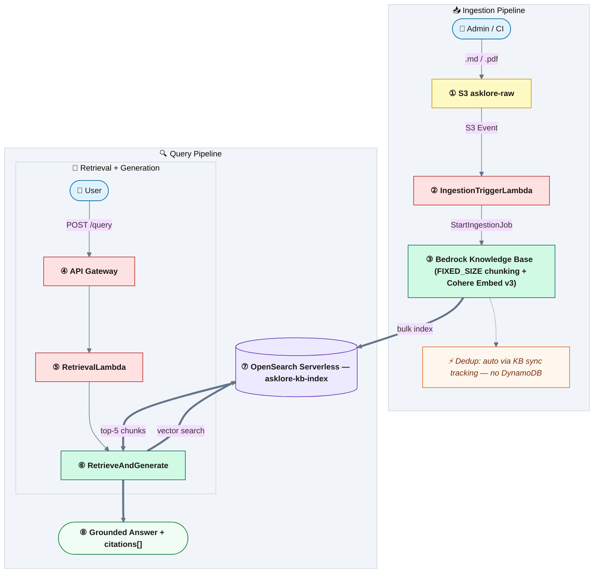

# AskLore

Internal tribal-knowledge RAG assistant built on AWS. Drop a markdown or PDF document into S3 and get grounded, cited answers back via a REST API — no hallucination, every answer traced to a source.

---

## Architecture



**Ingestion flow:** A `.md` or `.pdf` file dropped into S3 triggers `IngestionTriggerLambda`, which calls Bedrock `StartIngestionJob` on the Knowledge Base's S3 data source. The Knowledge Base owns chunking (`FIXED_SIZE`), embedding (Cohere Embed v3, 1024-dim), and indexing into OpenSearch Serverless — no custom chunking/embedding Lambda code.

**Query flow:** `POST /query` → `RetrievalLambda` calls Bedrock `RetrieveAndGenerate`, which does vector search against the Knowledge Base and grounded generation with Cohere Command R+ in a single call, and returns only the chunks actually referenced in `citations[]` as `sources`.

---

## AWS Services

| Role | Service |
|---|---|
| Document storage + event trigger | S3 + S3 Event Notifications |
| Ingestion orchestration | Bedrock Knowledge Base + Data Source (`asklore-kb`) |
| Embeddings | Bedrock Cohere Embed English v3 (`cohere.embed-english-v3`, 1024-dim) |
| Generation | Bedrock Cohere Command R+ (`cohere.command-r-plus-v1:0`) via `RetrieveAndGenerate` |
| Vector search | OpenSearch Serverless — VECTORSEARCH collection `asklore` |
| Compute | Lambda (Python 3.12) |
| API | API Gateway REST — `POST /query` |
| IaC | CloudFormation (`template.yaml`) |

## Repository layout

```
template.yaml                   # CloudFormation — all Phase 1 resources
lambda/
  kb-index-setup/
    handler.py                  # CFN custom resource → creates the AOSS vector/text/metadata index
    requirements.txt
  ingestion-trigger/
    handler.py                  # S3 event → Bedrock StartIngestionJob
    requirements.txt
  retrieval/
    handler.py                  # query → RetrieveAndGenerate → cited answer
    requirements.txt
scripts/
  build-and-deploy.sh           # build Lambda packages with uv, package, deploy
seed-data/
  infra-runbooks/               # 18 sample markdown runbooks (domain 1)
```

Lambda source dirs contain only `handler.py` + `requirements.txt`. Installed packages are generated into `build/` by `scripts/build-and-deploy.sh` and gitignored.

## Deploy

**Prerequisites:**
- [`uv`](https://github.com/astral-sh/uv) and AWS CLI v2, with credentials configured (`aws sts get-caller-identity` succeeds)
- Bedrock model access enabled for **Cohere Embed English v3** and **Cohere Command R+** (Bedrock console → Model access → Modify model access)

```bash
aws s3 mb s3://asklore-cfn-artifacts-$(aws sts get-caller-identity --query Account --output text)  # one-time
make validate
make build-deploy
```

That's it — `make build-deploy` builds the Lambda packages, packages the template, and deploys the stack in one step. View outputs (bucket names, AOSS endpoint, API URL) any time with:
```bash
aws cloudformation describe-stacks --stack-name asklore-stack --query "Stacks[0].Outputs" --output table
```

<details>
<summary>Advanced: non-default stack, custom AOSS admin, partial build/deploy</summary>

```bash
# Target a non-default stack
STACK_NAME=asklore-dev make build-deploy

# Grant a different IAM principal direct AOSS data access (defaults to your own caller identity)
AOSS_ADMIN_PRINCIPAL_ARN=arn:aws:iam::<account>:user/<you> make build-deploy

# Build or deploy independently
bash scripts/build-and-deploy.sh --build    # build only, skip deploy
bash scripts/build-and-deploy.sh --deploy   # deploy only (assumes build/ exists)
```

</details>

## Ingest documents

Upload any markdown or PDF to the raw bucket — `IngestionTriggerLambda` fires automatically and starts a Knowledge Base ingestion job:

```bash
aws s3 cp my-runbook.md \
  s3://asklore-raw-<account>-<region>/infra-runbooks/my-runbook.md
```

To seed all 18 sample runbooks at once:

```bash
aws s3 sync seed-data/infra-runbooks/ \
  s3://asklore-raw-<account>-<region>/infra-runbooks/
```

Bedrock allows only one ingestion job per data source at a time — syncing many files in quick succession may log a `ConflictException` for some of them; those files are picked up on the next sync. Check job status in the Bedrock console (Knowledge Bases → `asklore-kb` → Data source → Sync history) or via `aws bedrock-agent list-ingestion-jobs`.

## Query the API

```bash
curl -X POST <ApiUrl from stack outputs> \
  -H "Content-Type: application/json" \
  -d '{"query": "How do I rotate an SSL certificate?"}'
```

Response:
```json
{
  "answer": "To rotate an SSL certificate...",
  "sources": [
    { "doc_title": "ssl-cert-rotation", "source_key": "infra-runbooks/ssl-cert-rotation.md" }
  ]
}
```

Command R+ returns `citations[]` that reference the exact documents used — `sources` in the response contains only chunks the model actually cited, not all retrieved candidates.

## Validate a fresh deployment

After `make build-deploy` and seeding the runbooks (see [Ingest documents](#ingest-documents)), wait for the ingestion job to reach `COMPLETE`:

```bash
aws bedrock-agent list-ingestion-jobs \
  --knowledge-base-id <KnowledgeBaseId from stack outputs> \
  --data-source-id <DataSourceId — see Bedrock console, Knowledge Bases → asklore-kb → Data source>
```

Then run these sample prompts against `POST /query` — each one maps to a specific seed runbook, so a correct `sources` entry confirms retrieval, chunking, and generation are all wired correctly end to end:

```bash
API_URL=<ApiUrl from stack outputs>

curl -s -X POST "$API_URL" -H "Content-Type: application/json" \
  -d '{"query": "How do I rotate an SSL certificate?"}' | jq
# expect sources: infra-runbooks/ssl-cert-rotation.md

curl -s -X POST "$API_URL" -H "Content-Type: application/json" \
  -d '{"query": "What are the steps to fail over the database?"}' | jq
# expect sources: infra-runbooks/database-failover.md

curl -s -X POST "$API_URL" -H "Content-Type: application/json" \
  -d '{"query": "The payment service is down, how do I restart it?"}' | jq
# expect sources: infra-runbooks/payment-service-restart.md

curl -s -X POST "$API_URL" -H "Content-Type: application/json" \
  -d '{"query": "Who is on call and how do I escalate an incident?"}' | jq
# expect sources: infra-runbooks/on-call-escalation.md and/or infra-runbooks/incident-response-checklist.md

curl -s -X POST "$API_URL" -H "Content-Type: application/json" \
  -d '{"query": "How do I flush the Redis cache safely?"}' | jq
# expect sources: infra-runbooks/redis-cache-flush.md
```

**Grounding check (should NOT return a confident, cited answer):**
```bash
curl -s -X POST "$API_URL" -H "Content-Type: application/json" \
  -d '{"query": "What is the company'\''s parental leave policy?"}' | jq
# no seed runbook covers this — sources should be empty/near-empty, and the
# answer should not confidently state a policy that isn't grounded in a source
```

If `sources` comes back empty for the on-topic prompts, the ingestion job likely hasn't completed yet (`asklore-kb` sync is still running or `ConflictException`'d — see [Ingest documents](#ingest-documents)).

## Implementation phases

| Phase | Goal | Status |
|---|---|---|
| 1 | Single-domain MVP — upload → query with citations via Bedrock Knowledge Base | 🔄 In progress |
| 2 | Multi-domain ingestion — dedup now automatic via Knowledge Base sync | Planned |
| 3 | Domain router + recency weighting + multi-turn query rewriting (hybrid search/rerank now native to `RetrieveAndGenerate`) | Planned |
| 4 | Bedrock Guardrails, grounded prompts, groundedness scoring | Planned |
| 5 | RAGAS evaluation suite + CI regression gate | Planned |
| 6 | X-Ray tracing, CloudWatch dashboards, semantic cache, RBAC (via KB metadata filtering) | Planned |

See [`AskLore_Implementation_Plan.md`](AskLore_Implementation_Plan.md) for detailed step-by-step progress.
